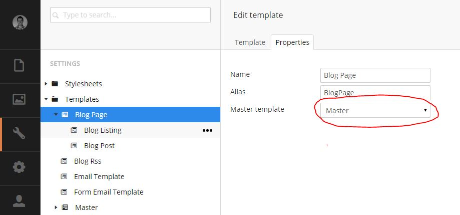
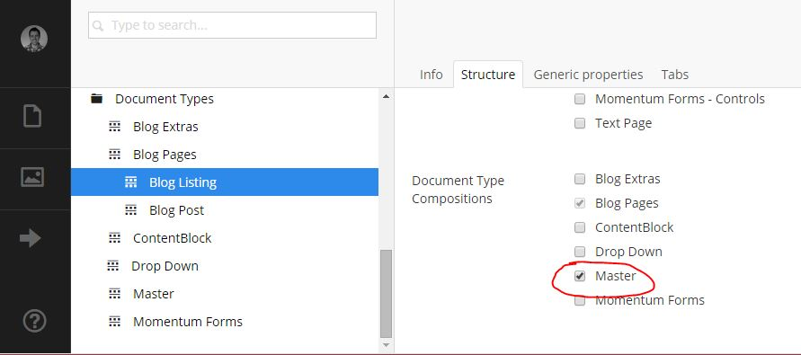
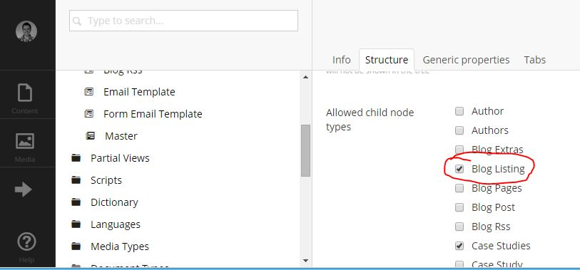
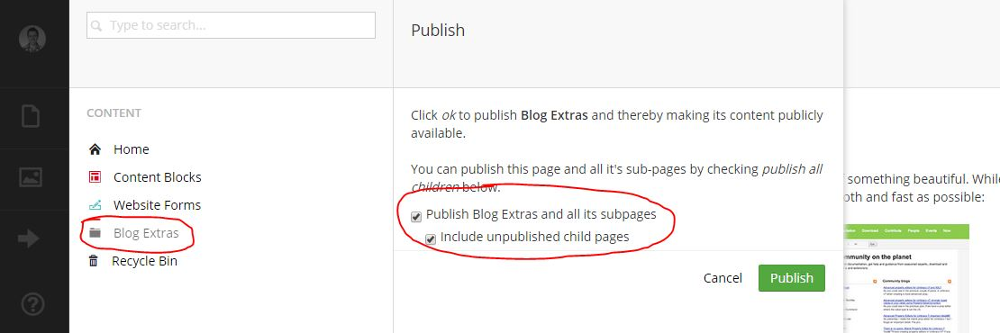
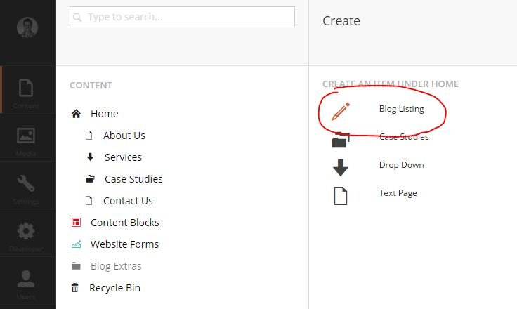

# Installation #

To install the plugin, you can upload the package file through the **Install Local Package** in the Developer section of the Umbraco backoffice.

Once the package is installed you will need to integrate it within your own master page and allow the the creation of the blog listing under you homepage.

## 1. Add to your Template ##

This plugin is designed to intergrate with your existing template and you will need to 
add your master page template to the blog. 

- Go To Settings->Templates->Blog Page. 
- Click the Properties tab and select your Master Template. 
- Click Save

## 2. [Optional] Master Document Types Properties - Inherit Properties from your Master DocType ##
If you have custom properties in your Master Document Type, that you would like included 
in you blog pages (e.g. Meta Title / Description), you will need to make a couple of 
changes. 

- Go To **Settings->Document types->Blog Pages->Blog Listing**. 
- Under the **Structure Tab**, Select the Document Type Compositions that you would like to apply to your 
document type *(e.g. Master)*. 
- Click Save. 
- Do the same for the Blog Post Document Type.

## 3. Document Type - Allow the creating of the Blog Listing. ##
To allow content editors to add the Blog to the site, you will have to specify where 
they will be allowed to add the listing of blog posts. This usually will be under the 
Home or Textpage nodes. 

Under **Settings->Document types**, pick the document type that you would like to allow the creation 
of Blog posts under *(e.g. Home)* Under the Structure Tab tick the Allowed child node type 
of "Blog Listing" Click Save

## 4. Content - Add to your website ##
Under the root of your Content section you should find an un-piblished Node called 
**"Blog Extras"**. 

Right Click on **"Blog Extras** and click **Publish**. Select both tick Boxes 
(**"Publish Blog Extras and all its subpages"** & **"Include unpublished child pages"**).

Click **Publish**. This is where you Authors and Categories are managed. 

*Note: These pages will not show directly on your site.*

**Next you will need to add the Blog Listing Page.**

- Right click on the node where you want to add your blog.
- Click Create and add the name of your Blog Make any adjustments to the properties.
- Click Save & Publish.

## 5. Create your first Blog Post ##

Right click on the blog listing page and select **"Create"**

Enter the title of the blog post, the main content and any other options and click 
**"Save & Publish"**. 

If all goes well, you'll have a new blog post on your site.
