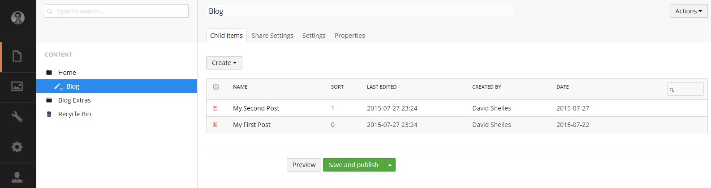

#Blog Listing#

The blog listing page is the top level page for all your articles. It will list all articles that are created underneath it.

Multiple **Blog Listing** pages can be created throughout the site. It can be utilised as a news, blog, media realease, and/or other section to your website.

##Create an Category##

Creating an category is the same as creating any other page. 

1. Right click on the page that you would like to create the listing under *(e.g. "Home")* and click **Create**.
2. Select **Blog Listing**
3. Enter the name of the listing *(e.g. **Blog**)*.
4. For more information on all the settings, check out the **Blog Settings** chapter in the documentation.
6. Click save and publish.

The Blog listing will now appear on your site ready for your First Article *(See the "Blog Posts" chapter for creating your first article)*.

