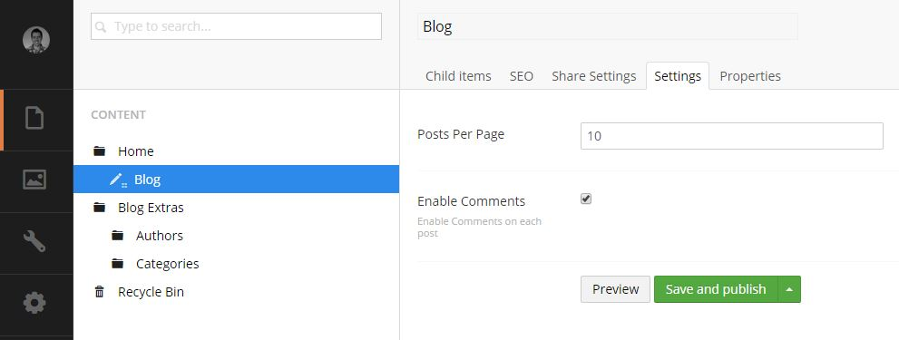
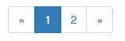

#General Settings#
You can access the main settings to the blog by going to the Content Section and editing the **Blog Listing** page.

*This is usually located under **Home / Blog** but may be different depending on your setup*

##Posts Per Page##
This setting allows you to change the number of posts displayed on the blog listing page at any 1 time. If there are more posts than the given number, a numberd list of pages is show to allow the user to navigate to more posts as per the below screen shot. *The default number of posts is 10 per page*

##Enable Comments##
Select this box if you would like to allow users to add comments to you blog posts.

*NOTE: Please make sure that your developer has setup the comments before enabling*