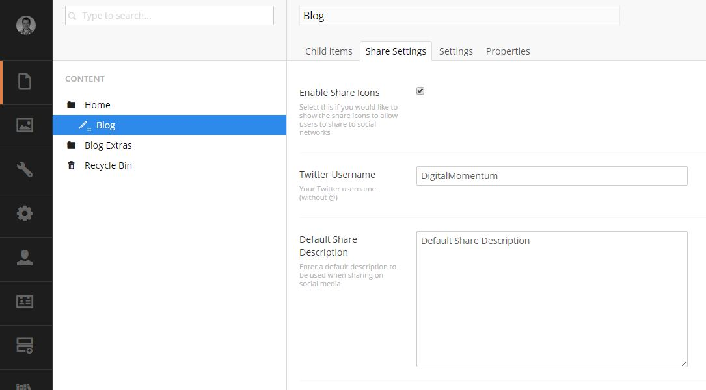

#Social Settings#
You can access the social settings to the blog by going to the Content Section and editing the **Blog Listing** page.

*This is usually located under **Home / Blog** but may be different depending on your setup*

##Enable Share Icons##
This option adds share icons to the blog post, allowing users to easily share your articles on social media.

##Twitter Username##
This is used when a user is sharing one of your articles on twitter. If you twitter name is **@blogmomentum**, then enter **blogmomentum** without the @ symbol.

##Default Share Description##
When a user shares your article on social media, often a description is displayed. If you dont enter a **Share Description** on an article, this generic description will be used instead.