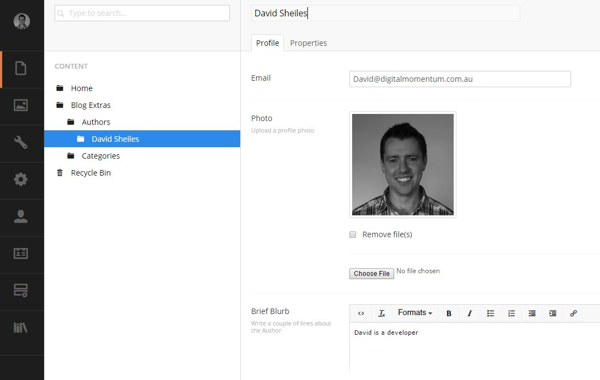

#Authors#

Authors are created / edited through **Blog Extras/Authors** in the content section. 

##Create an Author##

Creating an author is the same as creating any other page. 

1. Right click on **Blog Extras/Authors** and click **Create**.
2. Select **Author**
3. Enter the Authors Name.
4. Fill in the Authors Email and a short description of the author.
5. To upload a profile image of the author, click the "Choose File" button and select a JPEG, GIF or PNG image.
6. Click save and publish.

The author will now appear in the Authors section in the side bar on the website.

When Creating a blog post, you will be able to select any one of the created Authors in the list.

