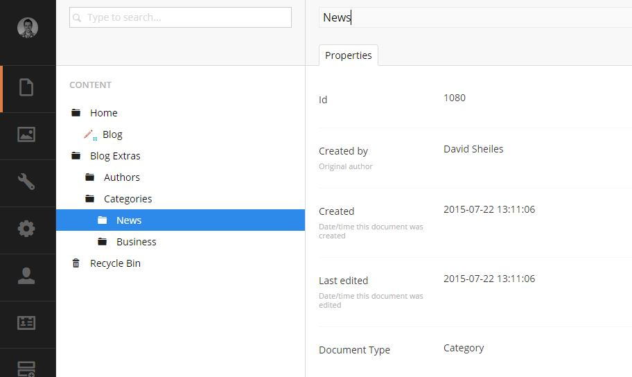

#Categories#

Categories are created / edited through **Blog Extras/Categories** in the content section. 

##Create an Category##

Creating an category is the same as creating any other page. 

1. Right click on **Blog Extras/Categories** and click **Create**.
2. Select **Category**
3. Enter the Category Name.
4. There are no other options that need to be setup other than the name.
6. Click save and publish.

The category will now appear in the Category section in the side bar on the website.

When Creating a blog post, you will be able to select any of the created categories in the list.

